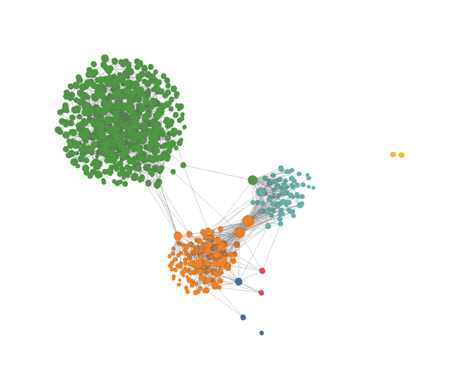

# Fast 3D Graph

**Explore your entire Obsidian vault as a fast, lightweight 3D force‑directed graph — smooth even with tens of thousands of notes.**

> 수만 개의 노트도 끊김 없이. 옵시디언 그래프를 빠르고 가볍게 **3D**로 보여주는 뷰입니다.



---

## English

### What it is

Fast 3D Graph renders your whole vault as a 3D, real‑time, force‑directed graph. It is built around one goal: **show a huge number of notes beautifully in 3D, and keep it smooth.** Where the built‑in graph slows down on large vaults, this view stays fluid by splitting work across threads and leaning on the GPU.

### Highlights

- 🌐 **True 3D graph** of your vault, rendered with Three.js — nodes as GPU‑instanced spheres, links as a single line batch (2 draw calls total).
- ⚡ **Built for scale** — **20,000 nodes render at ~75 FPS.** The force simulation runs in a **Web Worker**, so the camera and rendering stay smooth while the layout settles. Idle CPU drops to zero once it settles (alpha decay).
- 🎨 **Cluster‑aware layout** — notes are grouped by folder or tag, with cohesion (pull same‑group together) and separation (push groups apart) forces, so communities are spatially distinct instead of one tangled ball.
- 🖱️ **Interactive** — click a node to open the note, hover for its title, drag to orbit, scroll to zoom.
- 🔎 **Local‑graph mode** — focus on the active note and its neighbors up to N hops.
- 🎞️ **Gentle auto‑rotation** for a presentable 3D feel (toggleable).
- 🚫 **Respects Obsidian's _Excluded files_** setting (Settings → Files and links).

### Demo

A real vault settling into its 3D layout:

<video src="https://github.com/jkRaccoon/obsidian-fast-graph/raw/main/sample.mp4" controls muted loop width="100%"></video>

*(If the player doesn't load inline, [download/open sample.mp4](sample.mp4).)*

20,000 nodes — still smooth:

<video src="https://github.com/jkRaccoon/obsidian-fast-graph/raw/main/20k.mp4" controls muted loop width="100%"></video>

*(Or [open 20k.mp4](20k.mp4).)*

### Performance

Measured on a real machine (Apple Silicon), render FPS is decoupled from the worker physics:

| Nodes  | Edges   | Render | Physics tick | Settle |
| ------ | ------- | ------ | ------------ | ------ |
| ~2,000 | ~5k     | 60 FPS | < 5 ms       | instant |
| ~10,000| ~25k    | 60 FPS | ~69 ms       | ~10 s  |
| 20,000 | ~51k    | **75 FPS** | ~101 ms  | ~30 s  |

Because the simulation lives in a Web Worker, a heavy tick never stalls the view — you can orbit, zoom, and click throughout while the graph organizes itself.

### Installation

Not yet in the community store. To install manually:

```bash
yarn install
yarn build
```

Then copy `main.js`, `manifest.json`, and `styles.css` into your vault at:

```
<your vault>/.obsidian/plugins/fast-graph/
```

Enable **Fast 3D Graph** under Settings → Community plugins. Desktop only.

### Usage

- Click the **git‑fork ribbon icon**, or run the command **"3D 그래프 열기" / "Open 3D graph"**.
- Run **"Open 3D local graph"** to focus on the active note's neighborhood.
- **Drag** to orbit · **scroll** to zoom · **click** a node to open it · **hover** for the title.

### Settings

Color grouping (folder / tag / none) · local‑graph depth · node size by degree · hover labels · **auto‑rotate** · **respect Obsidian excluded files** · max nodes.

### How it works

Three layers, split by thread so physics never blocks rendering:

- **Data** — reads `metadataCache.resolvedLinks` into compact typed arrays; groups by folder/tag; applies the excluded‑files filter.
- **Physics (Web Worker)** — Barnes‑Hut octree repulsion + spring links + group cohesion/separation, integrated with per‑tick displacement clamping for stability, then sent back as a transferable position buffer.
- **Render (main thread, Three.js)** — `InstancedMesh` nodes + `LineSegments` edges updated from the latest position buffer each frame; `OrbitControls` camera; raycast picking.

---

## 한국어

### 소개

Fast 3D Graph는 vault 전체를 **실시간 3D force‑directed 그래프**로 그립니다. 목표는 하나입니다 — **아주 많은 노트도 3D로 멋지게, 그리고 끊김 없이 보여주기.** 기본 그래프가 큰 vault에서 버벅이는 지점을, 연산을 스레드로 분리하고 GPU를 활용해 부드럽게 유지합니다.

### 특징

- 🌐 **진짜 3D 그래프** — Three.js로 렌더. 노드는 GPU 인스턴싱 구, 엣지는 단일 라인 배치(전체 draw call 2개).
- ⚡ **대형 vault를 위한 설계** — **2만 노드를 ~75 FPS로 렌더.** 물리 시뮬레이션은 **Web Worker**에서 돌아, 레이아웃이 자리를 잡는 동안에도 카메라·렌더가 부드럽습니다. 안정되면(alpha decay) idle CPU는 0이 됩니다.
- 🎨 **군집 인식 레이아웃** — 폴더/태그로 노드를 묶고, 응집(같은 그룹을 모음) + 분리(그룹끼리 벌림) 힘으로 군집이 한 덩어리로 뭉치지 않고 공간적으로 또렷이 나뉩니다.
- 🖱️ **상호작용** — 노드 클릭 시 노트 열기, 호버 시 제목, 드래그로 회전, 스크롤로 줌.
- 🔎 **로컬 그래프 모드** — 현재 노트와 N단계 이웃만 집중해서 보기.
- 🎞️ **천천히 자동 회전**으로 입체감 있게(끄기 가능).
- 🚫 **Obsidian "제외할 파일" 설정 반영**(설정 → 파일 및 링크).

### 데모

실제 vault가 3D 레이아웃으로 자리 잡는 모습:

<video src="https://github.com/jkRaccoon/obsidian-fast-graph/raw/main/sample.mp4" controls muted loop width="100%"></video>

*(인라인 플레이어가 안 보이면 [sample.mp4 열기](sample.mp4).)*

2만 노드 — 그래도 부드럽습니다:

<video src="https://github.com/jkRaccoon/obsidian-fast-graph/raw/main/20k.mp4" controls muted loop width="100%"></video>

*(또는 [20k.mp4 열기](20k.mp4).)*

### 성능

실측(Apple Silicon). 렌더 FPS는 워커 물리와 분리되어 있습니다:

| 노드   | 엣지   | 렌더    | 물리 tick | 수렴   |
| ------ | ------ | ------- | --------- | ------ |
| ~2,000 | ~5천   | 60 FPS  | < 5 ms    | 즉시   |
| ~10,000| ~2.5만 | 60 FPS  | ~69 ms    | ~10초  |
| 20,000 | ~5.1만 | **75 FPS** | ~101 ms | ~30초  |

물리가 워커에 있기 때문에, tick이 무거워도 화면이 멈추지 않습니다 — 그래프가 정렬되는 동안에도 회전·줌·클릭이 자유롭습니다.

### 설치

아직 커뮤니티 스토어에 없습니다. 수동 설치:

```bash
yarn install
yarn build
```

생성된 `main.js`, `manifest.json`, `styles.css`를 vault의 다음 경로에 복사:

```
<vault>/.obsidian/plugins/fast-graph/
```

설정 → 커뮤니티 플러그인에서 **Fast 3D Graph**를 켭니다. (데스크톱 전용)

### 사용법

- **git‑fork 리본 아이콘** 클릭, 또는 명령 **"3D 그래프 열기"** 실행.
- **"3D 로컬 그래프 열기"**로 현재 노트 주변만 보기.
- **드래그** 회전 · **스크롤** 줌 · 노드 **클릭** 열기 · **호버** 제목.

### 설정

색상 그룹(폴더/태그/없음) · 로컬 그래프 깊이 · degree 기반 노드 크기 · 호버 라벨 · **자동 회전** · **Obsidian 제외 파일 반영** · 최대 노드 수.

### 동작 원리

물리가 렌더를 막지 않도록 3개 레이어를 스레드로 분리:

- **데이터** — `metadataCache.resolvedLinks`를 typed array로 빌드, 폴더/태그 그룹화, 제외 파일 필터 적용.
- **물리(Web Worker)** — Barnes‑Hut octree 척력 + 스프링 인력 + 그룹 응집/분리. per‑tick 변위 클램프로 안정적으로 적분 후, 위치 버퍼를 transferable로 메인에 전송.
- **렌더(메인, Three.js)** — 최신 위치 버퍼로 매 프레임 `InstancedMesh` 노드 + `LineSegments` 엣지 갱신. `OrbitControls` 카메라, raycast 피킹.

---

<sub>Made for large Obsidian vaults. 🦝</sub>
